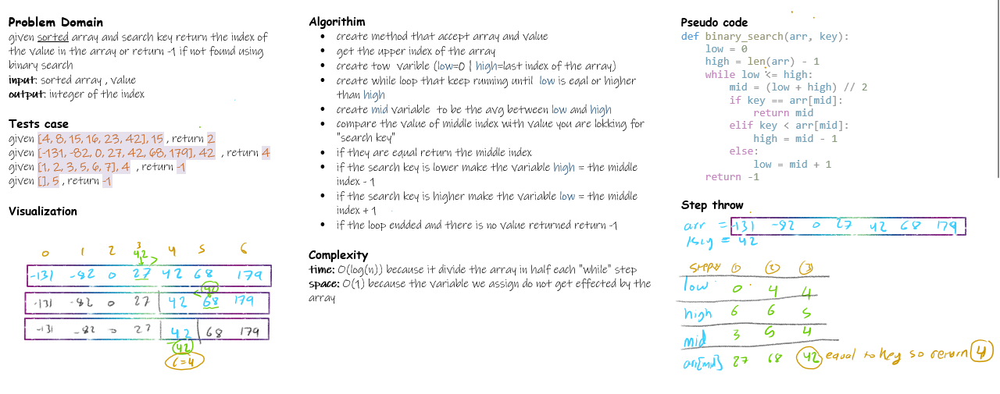

# Array Binary Search

Write a function called `BinarySearch` which takes in 2 parameters: a sorted array and the search key. Without utilizing any of the built-in methods available to your language, return the index of the array’s element that is equal to the value of the search key, or -1 if the element is not in the array.

## Whiteboard Process

<!-- Embedded whiteboard image -->



## Approach & Efficiency

time: O(log(n)) because it divide the array in half each "while" step
space: O(1) because the variable we assign do not get effected by the array

## Solution

```python
def binary_search(arr, key):
    low = 0
    high = len(arr) - 1
    while low <= high:
        mid = (low + high) // 2
        print(mid)
        if key == arr[mid]:
            return mid
        elif key < arr[mid]:
            high = mid - 1
        else:
            low = mid + 1
    return -1
```
