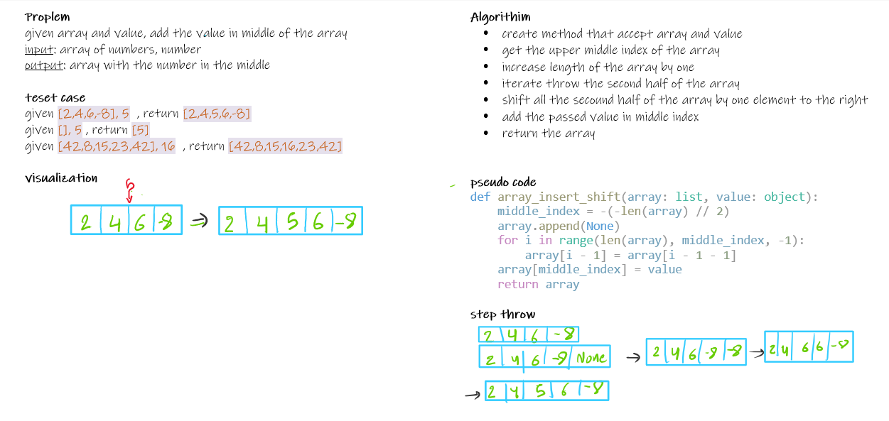

# Array Insert Shift

Create a function called `insertShiftArray` which takes in an array and a value to be added. Without utilizing any of the built-in methods available to your language, return an array with the new value added at the middle index.

## Whiteboard Process

<!-- Embedded whiteboard image -->



## Approach & Efficiency

time: O(n)
space: O(1)

## Solution

```python
def array_insert_shift(array: list, value: object):
    middle_index = -(-len(array) // 2)

    array.append(None)
    for i in range(len(array), middle_index, -1):
        print(array)
        array[i - 1] = array[i - 1 - 1]
    array[middle_index] = value
    return array

print(array_insert_shift([1, 2, 3, 4], 5))  # [1, 2, 5, 3, 4]
```
