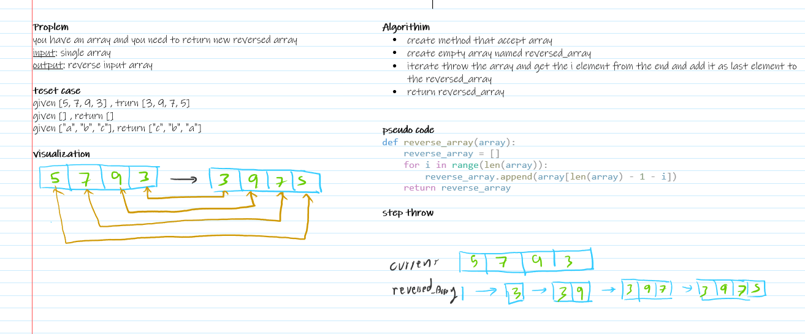

# Challenge Title

Create function called reverseArray which takes an array as an argument. Without utilizing any of the built-in methods available in python language, return an array with elements in reversed order.

## Whiteboard Process
<!-- Embedded whiteboard image -->


## Approach & Efficiency

time: O(n)
space: O(n)

## Solution

```python
def reverse_array(array):
    reverse_array = []
    for i in range(len(array)):
        reverse_array.append(array[len(array) - 1 - i])
    return reverse_array

reverse_array([5, 4, 3, 2, 1]) # return [1, 2, 3, 4, 5]

```
