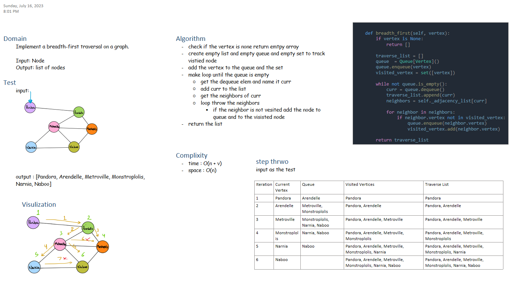

# Class 36 - Breadth First Graph

## Challenge

Implement a breadth-first traversal on a graph.

## WHITEBOARD



## Approach & Efficiency

- Time: O(n + v)
- Space: O(n)

## Code

[graph.py](./graph.py)

## Test

```bash

pytest -k test_breadth_first

```

[tests](./tests/test_graph.py)
