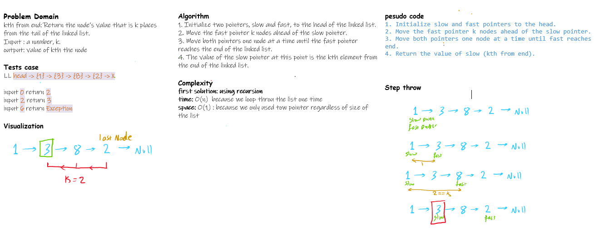
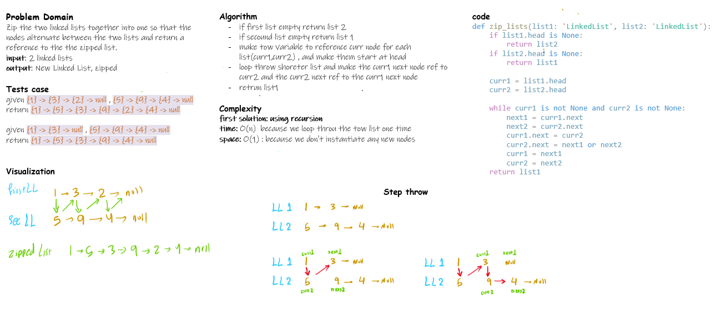

# Challenge Title

## class 05

Create linked-list that has the following methods:

- `insert(value)` which adds a new node with the given value to the beginning of the list
- `includes(value)` which returns a boolean result depending on whether that value exists as a Node’s value somewhere within the list
- `toString()` which returns a string representing all the values in the Linked List, formatted as:

`"{ a } -> { b } -> { c } -> NULL"`

## class 06

Write the following methods for the Linked List class:

- append

    arguments: new value
    adds a new node with the given value to the end of the list

- insert before

    arguments: value, new value
    adds a new node with the given new value immediately before the first node that has the value specified
- insert after

    arguments: value, new value
    adds a new node with the given new value immediately after the first node that has the value specified

## class 07

- kth from end

    arguments: k
    returns the node’s value that is k places from the tail of the linked list.

    You have access to the Node class and all the properties on the Linked List class as well as the methods created in previous challenges.

## class 08

- zip lists

    arguments: 2 linked lists
    returns a linked list with the two linked lists zipped together into one so that the nodes alternate between the two lists and return a reference to the head of the zipped list.

## Approach & Efficiency

| Method | Time | Space |
|--------|------|-------|
| insert | O(1) | O(1) |
| insert_before | O(n) | O(1) |
| insert_after | O(n) | O(1) |
| includes | O(n) | O(1) |
| toString | O(n) | O(1) |
| get_item | O(n) | O(1) |
| kth_from_end | O(n) | O(1) |
| zip_lists | O(n) | O(1) |

## Code

- [Linked List](./linked_list.py)

- [Linked List but little bit advance](./linked_list_adv.py)
