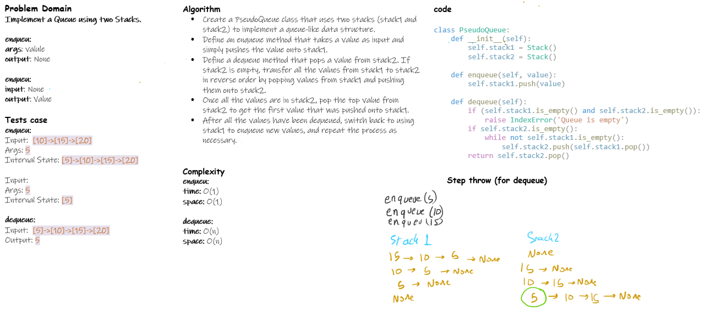

# Pseudo Queue

Implement a Queue using two Stacks.

## Whiteboard Process

<!-- Embedded whiteboard image -->

## Approach & Efficiency

enqueue:

    time: O(1): because we are adding to the end of the list
    space: O(1): because we are not creating any new variables

dequeue:

    time: O(n): because we are looping through the list
    space: O(n): because we are creating a new list

## Solution

link to the code: [pseudo_queue.py](./pseudo_queue.py)
