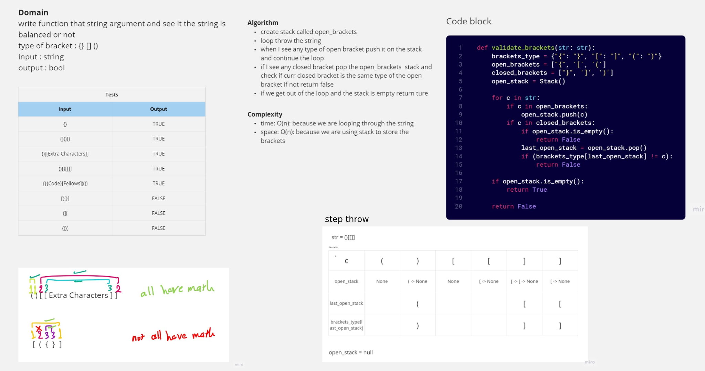

# validate brackets

write function that string argument and see it the string is balanced or not
type of bracket : {} [] ()

## Whiteboard Process

<!-- Embedded whiteboard image -->

## Approach & Efficiency

time: O(n): because we are looping through the string
space: O(n): because we are using stack to store the brackets

## Solution

link to the code: [validate_brackets](./validate_brackets.py)
