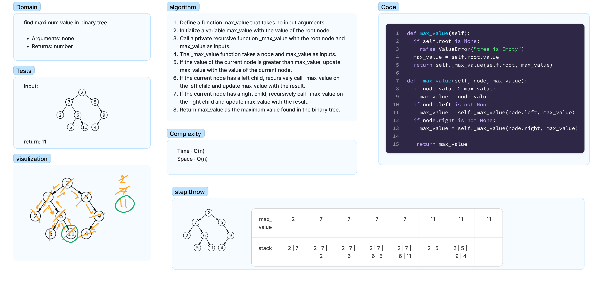
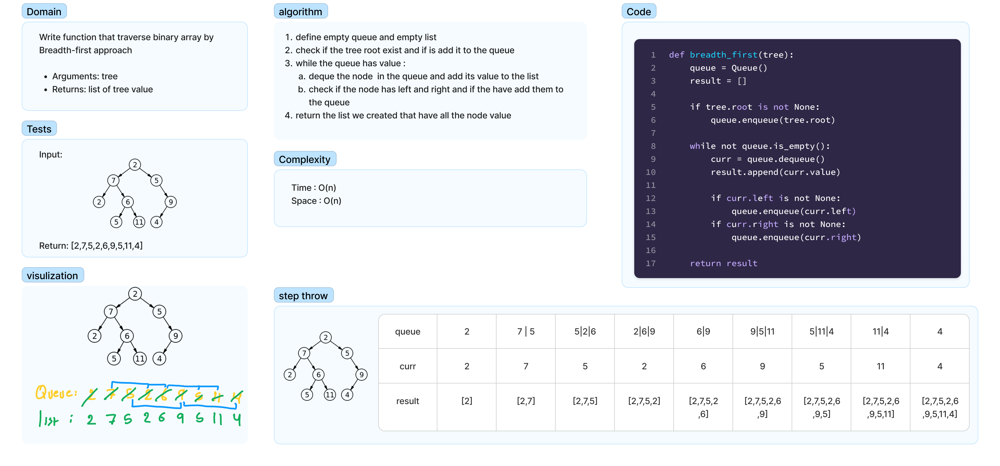

# Trees

## class 15

create tow classes
1- Binary Tree with 3 methods:

    - pre_order: root -> left -> right
    - in_order: left -> root -> right
    - post_order: left -> right -> root

2- Binary Search Tree with 2 methods:

    - add: add new node to the tree
    - contains: check if the value is in the tree or not

## class 16

- find maximum value in binary tree
  - arguments: none
  - return: maximum value in the tree

**whiteboard:**

## class 17

Write function that traverse binary array by Breadth-first approach

Arguments: tree
Returns: list of tree value

**whiteboard:**

## Approach & Efficiency

| Method | Time | Space |
|--------|------|-------|
| pre_order | O(n) | O(1) |
| in_order | O(n) | O(1) |
| post_order | O(n) | O(1) |
| add | O(log n) | O(1) |
| contains | O(log n) | O(1) |
| max_value | O(n) | O(n) |
| breadth_first | O(n) | O(n) |

## Code

- [Binary Tree](./binary_tree.py)

- [Binary Search Tree](./binary_search_tree.py)

- [k-ary Tree](./k_ary_tree.py)
